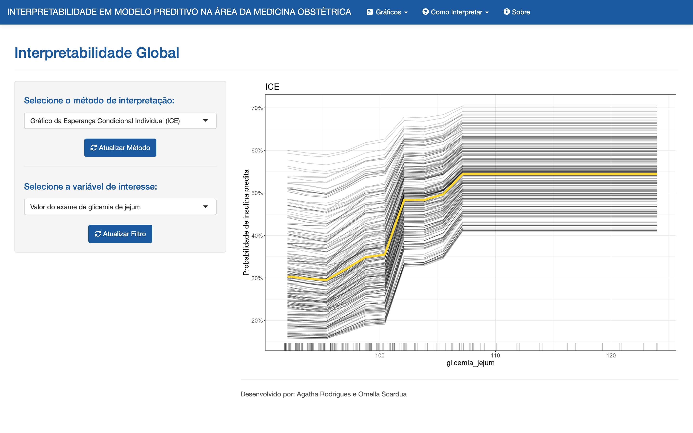

# Scientific Iniciation - Interpretability in predictive models in the health field

### Data

Cannot be published.

### Script

Fitted predictive models - `script/fit_models`

Interpreted XGBoost model - `script/interpret_models`

### Code outputs

`result/`

### Utilities

`util/`

### Shiny app

`shiny/`

### Software

R, 4.1.0 version, under IDE RStudio

This project aims to discuss predictive models and interpretability methods in the health field as result of a real application in the obstetric medicine area. Thus, it's expected to predict whether a pregnant diagnosed with gestational diabetes will use insulin previous at one moment to birth and to explain the reason why such outcome occured.

Therefore, the first step was evaluate the performance of each model in terms of prediction, and the second, to interpret the one which accuracy was greatest, in this case, the XGBoost model.
