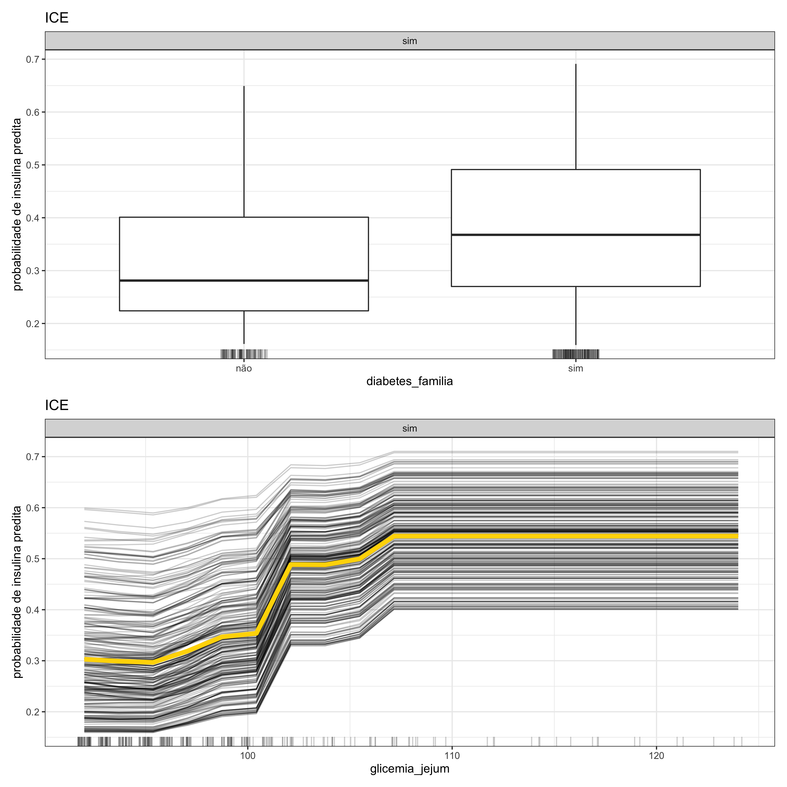

#### Gráfico da Esperança Condicional Individual (ICE)

No <strong>gráfico da esperança condicional individual</strong>, no eixo x estão contidos os valores ou categorias da variável e no eixo y está a probabilidade de ocorrência de um determinado desfecho. Além disso, no caso da variável analisada ser de natureza quantitativa (ou numérica), cada curva em preto representa uma observação do banco de dados e a curva em amarelo, que é exatamente a curva PDP, reflete o comportamento médio de todas as observações. Porém, sob a perspectiva de uma variável qualitativa (ou categórica), são gerados gráficos de _boxplot_, em que cada um diz respeito a uma categoria. Usualmente, o gráfico ICE é considerado como um método de interpretabilidade individual. No entanto, como não é possível identificar as curvas únicas e os _boxplots_ não permitem fazer interpretações individuais, esse método também pode ser classificado como global.
