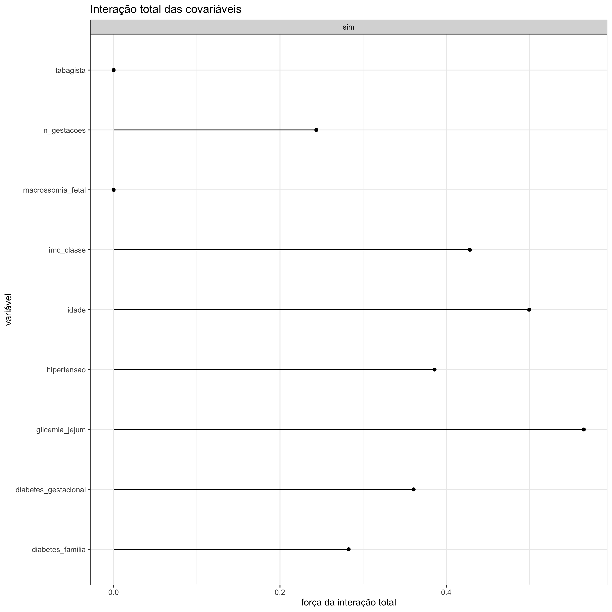
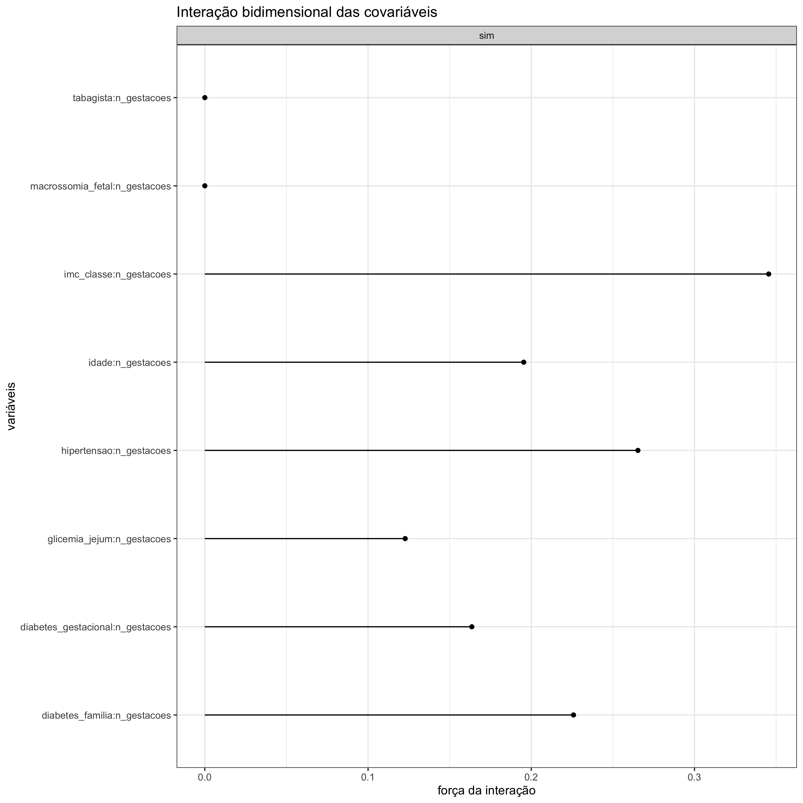

#### Interação Total das Covariáveis

Em um gráfico de interação total das covariáveis, é possível avaliar qual é o impacto sobre um certo desfecho quando cada variável está interagindo com todas as demais. O que é visto no eixo-x são os valores, entre zero e 1, da estatística H, que nada mais são do que o percentual de variância que pode ser explicada pela interação. A variável, alocada no eixo-y, que obtiver a maior porcentagem de estatística H será a variável que mantém interações mais fortes com as outras variáveis. Em outras palavras, isso significa que ela consegue explicar melhor o desfecho ao realizar esse tipo de interação. 

 

#### Interação Bidimensional das Covariáveis

A interpretação é semelhante à interpretação em que a interação entre as variáveis é total. Aqui, a diferença é que se pode identificar com qual variável uma determinada variável de interesse tem interações mais robustas.
