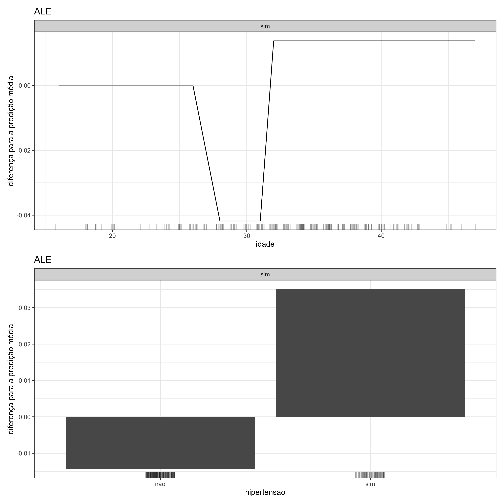

#### Gráfico de Efeitos Locais Acumulados (ALE)

O <strong>gráfico de efeitos locais acumulados</strong> é centralizado em zero, tornando sua interpretação bastante intuitiva: o valor em cada ponto da curva significa a diferença em relação à predição média. No entanto, quanto mais positivo for o valor no eixo y, maior será a probabilidade de ocorrer certo desfecho. Caso contrário, se esse valor for mais negativo, a probabilidade de ocorrência é menor. É importante mencionar que no eixo y os valores não representam probabilidades, e por isso situações negativas podem acontecer. No caso em que a variável a ser analisada é de natureza quantitativa (ou numérica), no eixo x estão os valores contidos nessa variável e no gráfico é gerada uma curva. Entretanto, se a variável que está sendo investigada é do tipo qualitativa (ou categórica), no eixo x encontram-se as categorias dessa variável e são geradas colunas.
