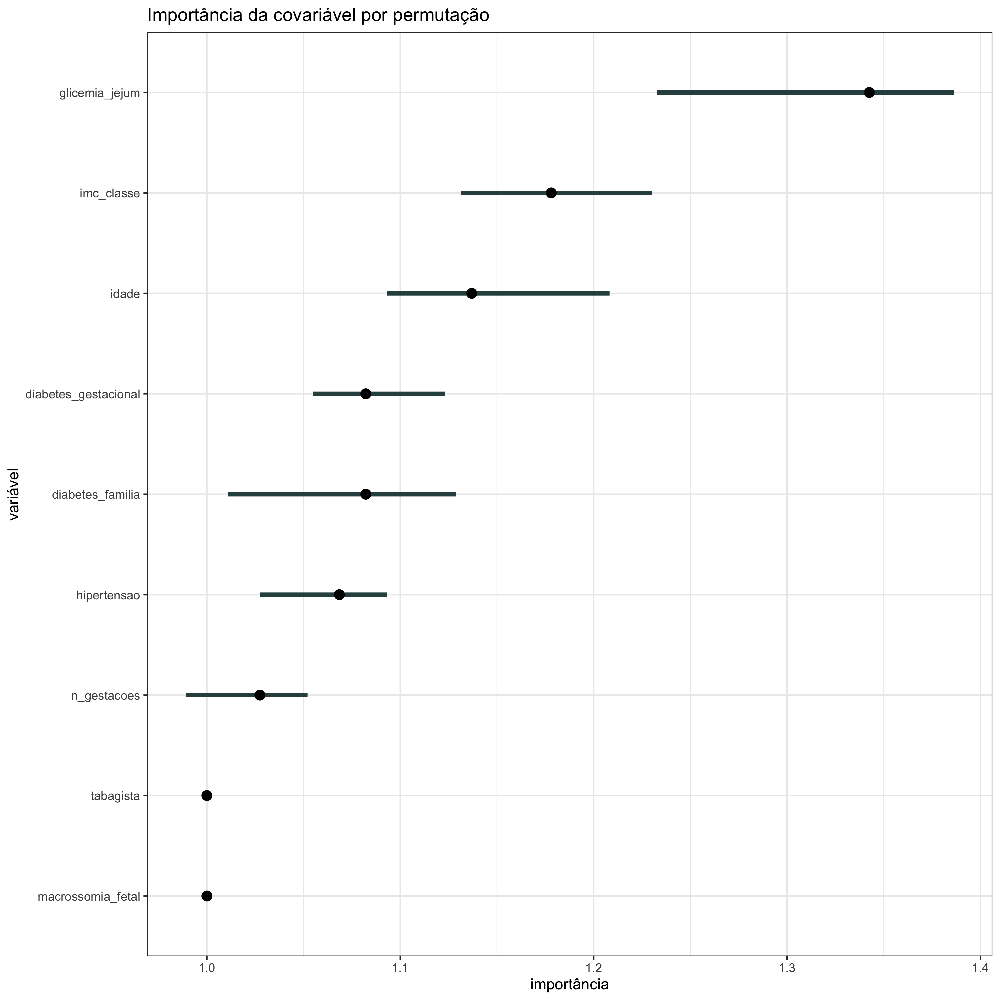

#### Importância da Covariável por Permutação

Com o <strong>gráfico da importância da covariável por permutação</strong>, espera-se avaliar quais variáveis foram mais e menos importantes em predizer um determinado desfecho. No eixo x pode ser visto em quanto o erro de um modelo em prever esse desfecho aumentou de acordo com a permutação de cada variável (disposta no eixo y) usada para explicar o desfecho. Geralmente, usa-se a medida do erro absoluto médio nos casos em que o desfecho é uma variável quantitativa (ou numérica), e a taxa de erro de classificação nos casos em que o desfecho é uma variável qualitativa (ou categórica). A interpretação, por sua vez, pode ser resumida em: quanto maior for o aumento no erro, maior será a contribuição da variável para o desfecho. Se o erro não se altera, a variável é considerada irrelevante. Nesse gráfico, os pontos correspondem ao valor exato do aumento no erro do modelo e as barras laterais ao ponto manifestam a variabilidade desse aumento.