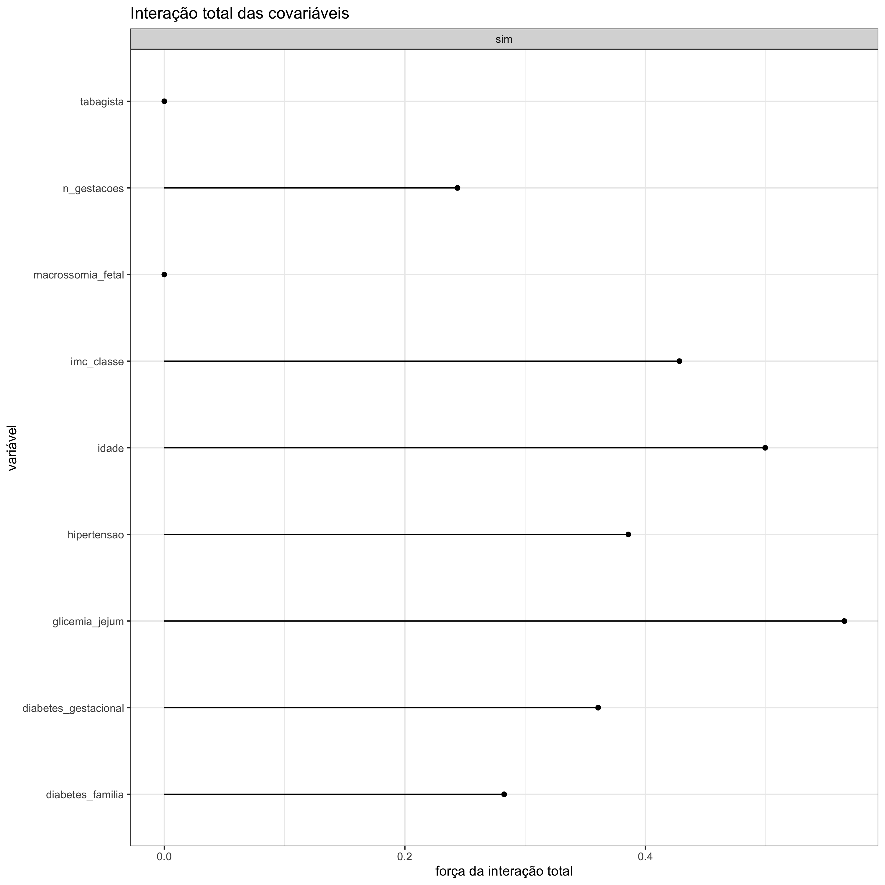
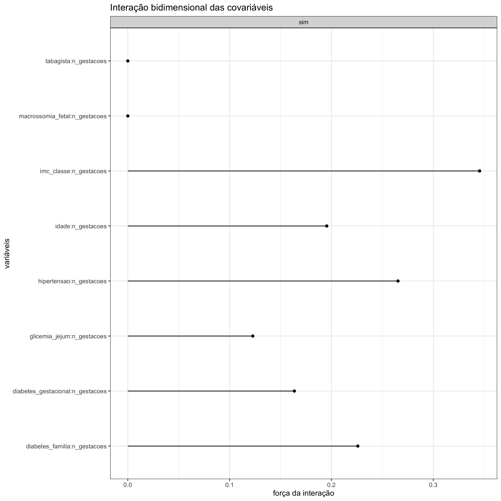

#### Interação Total das Covariáveis

Em um <strong>gráfico de interação total das covariáveis</strong>, é possível avaliar qual é o impacto da interação entre uma variável com as demais sobre um certo desfecho. Nesse gráfico, o eixo x corresponde aos valores entre zero e 1 da estatística H, que nada mais é do que o percentual de variância que pode ser explicada pela interação. A variável, que está alocada no eixo y, que obtiver a maior porcentagem de estatística H será a variável que mantém as interações mais fortes com as outras variáveis. Em outras palavras, isso significa que é a variável que tem mais poder para explicar o desfecho.

 

#### Interação Bidimensional das Covariáveis

No <strong>gráfico de interação bidimensional das covariáveis</strong>, a interpretação é semelhante à interpretação em que a interação entre as variáveis é total. Aqui, a diferença é que é possível identificar com qual variável uma determinada variável de interesse tem interações mais robustas.
