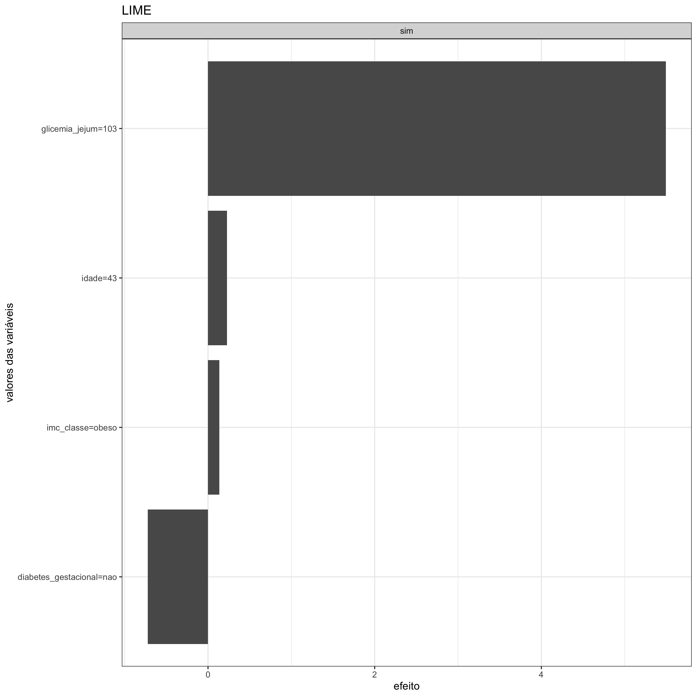

#### Modelo Interpretável Substituto Local (LIME)

Em um <strong>gráfico LIME</strong>, é possível identificar o efeito individual que cada variável tem sobre um certo desfecho a partir de informações que são fornecidas como entrada (dispostas no eixo y). Esse efeito, que é quantificado no eixo x e que pode ser positivo ou negativo, é resultado do produto entre um peso (ponderação) e os valores originais das variáveis. Entende-se por "efeito positivo" (barra acima de zero) a variável, com seu respectivo valor, que favorece a ocorrência do desfecho de interesse. Em contrapartida, quando a variável colabora para a não ocorrência do desfecho, ela exprime um efeito "negativo" (barra abaixo de zero). Se a soma dos efeitos positivos for maior do que a soma dos efeitos negativos, é provável que o desfecho aconteça.

