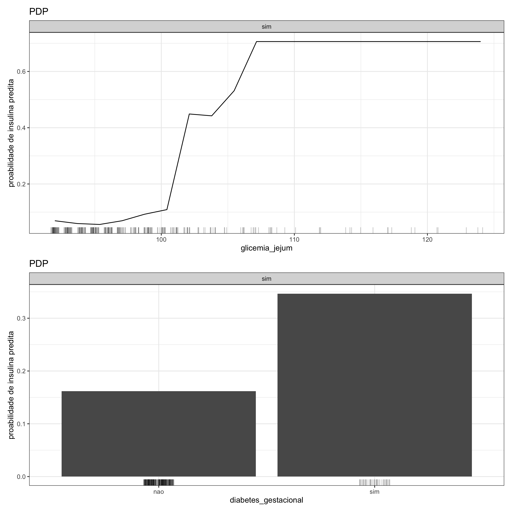

#### Gráfico de Dependência Parcial (PDP) - 1 variável

Em um <strong>gráfico de dependência parcial</strong> em que apenas uma variável está sendo analisada, no eixo x estão os valores ou as categorias da variável e no eixo y avalia-se a probabilidade de ocorrer um determinado desfecho. No caso em que a variável sob investigação é de natureza quantitativa (ou numérica), as probabilidades são quantificadas por uma curva. Por outro lado, se a variável é do tipo qualitativa (ou categórica), essas probabilidades são representadas por colunas. Em ambos os cenários, quanto mais alta for a curva ou a coluna, maior é a probabilidade.

 

#### Gráfico de Dependência Parcial (PDP) - 2 variáveis

No <strong>gráfico de dependência parcial</strong> em que o objetivo é avaliar o efeito de duas variáveis, os cenários possíveis são três: o cruzamento entre (1) duas variáveis quantitativas, (2) duas variáveis qualitativas e (3) uma variável quantitativa e outra qualitativa. No primeiro caso, é gerado um gráfico de calor no qual o eixo x e o eixo y descrevem as variáveis e cujas cores correspondem a diferentes probabilidades de ocorrer um determinado desfecho a partir da informação conjunta das duas variáveis analisadas. A diferença para um gráfico PDP em que as duas variáveis são qualitativas é que, nesse caso, as cores (e as probabilidades) são dispersas em blocos bem definidos. Por outro lado, em um gráfico PDP que avalia o efeito conjunto de variáveis com classes diferentes, isto é, quando uma variável é qualitativa e a outra é quantitativa, geram-se curvas em que cada uma delas representa uma classe da variável categórica, e os eixos x e y representam os valores da variável numérica e as probabilidades de acontecer o desfecho, respectivamente.

