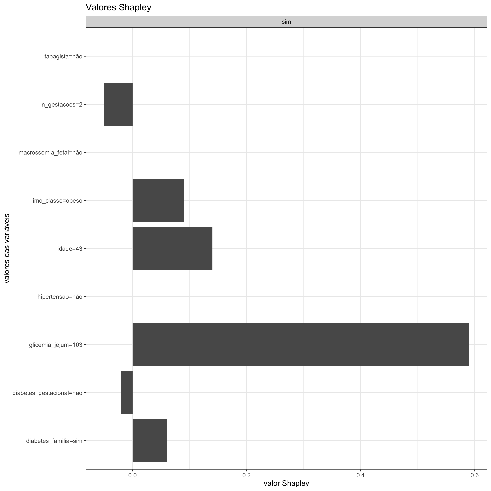

#### Valores Shapley

No <strong>gráfico de valores Shapley</strong>, a verdadeira contribuição de cada variável para um determinado desfecho ocorrer é facilmente distinguida. Essa contribuição, que é o valor Shapley propriamente dito, pode ser positiva ou negativa e é mensurada no eixo x. No eixo y, por sua vez, identificam-se as variáveis e seus respectivos valores fornecidos como entrada. A contribuição é considerada como "positiva" (barra acima de zero) quando a variável, e seu devido valor, aumenta a chance de ocorrer o desfecho de interesse. De outra forma, a contribuição da variável é "negativa" (barra abaixo de zero) quando a chance de ocorrer o desfecho diminui. A soma dos valores Shapley significa a diferença entre a predição real e a predição média: se o resultado for positivo, a probabilidade do desfecho acontecer é alta; do contrário, se ele for negativo, a probabilidade é pequena.

