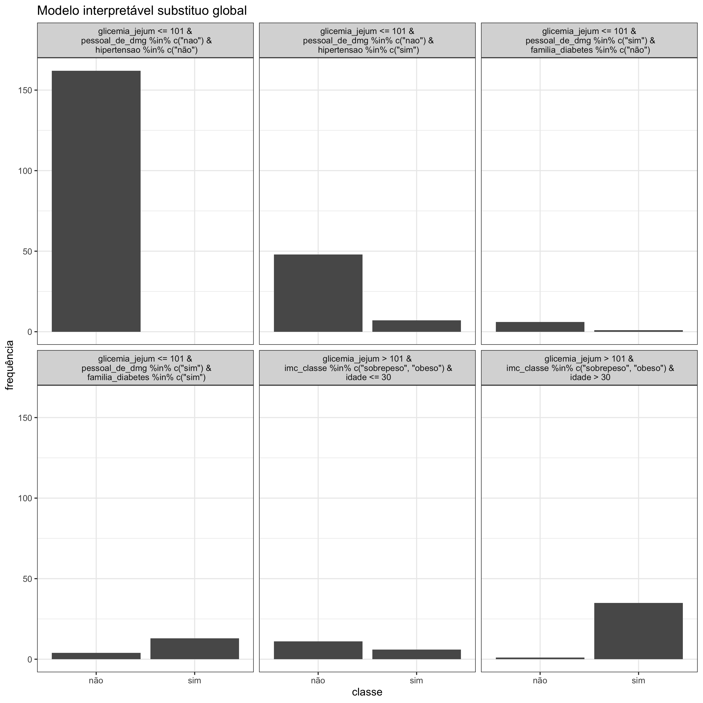

#### Modelo Interpretável Substituto Global

O modelo interpretável substituto global pode ser usado tanto em problemas em que o desfecho se trata de uma variável quantitativa (ou numérica) ou de uma variável qualitativa (ou categórica). No primeiro cenário, os gráficos de _boxplot_ que são gerados decorrem das condicionais com maior frequência entre as observações, sendo o eixo-y o valor do desfecho estimado. A condicional que resultar no maior valor estimado é a que tem mais influência sobre um desfecho de interesse. Do ponto de vista de um desfecho categórico, em vez de _boxplots_, são gerados gráficos de colunas nos quais o eixo-x indica as classes do desfecho e o eixo-y conta a quantidade de observações que atendem a determinadas condicionais. A interpretação é análoga ao desfecho numérico. 
