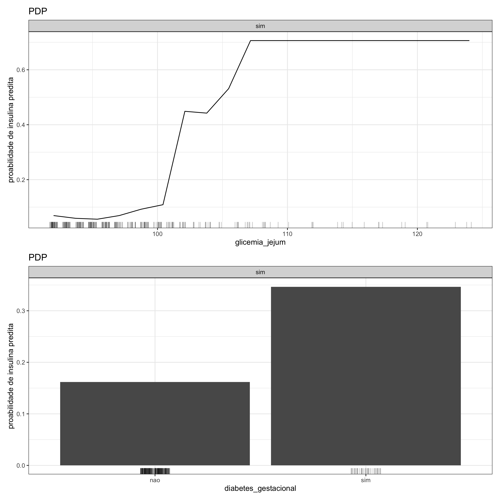
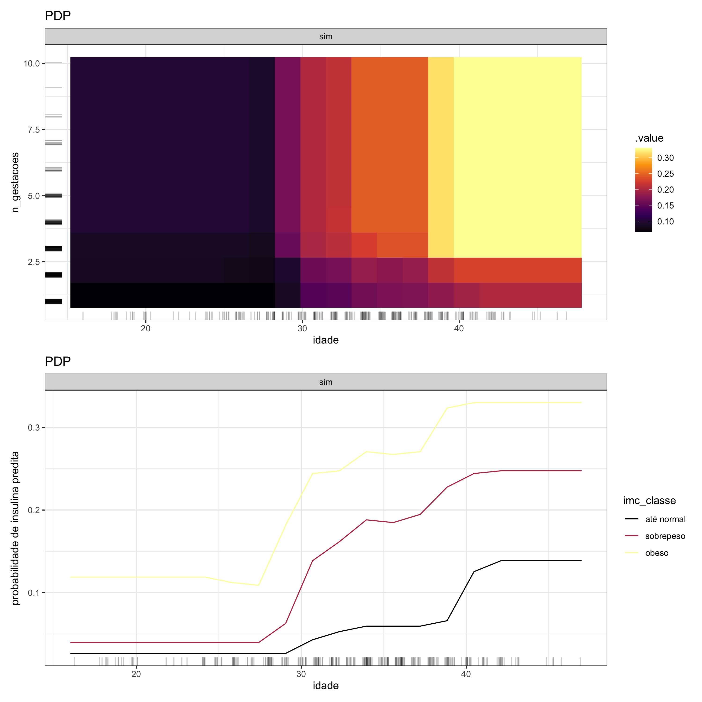

#### Gráfico de Dependência Parcial (PDP) - 1 variável

Em um gráfico de dependência parcial em que apenas uma variável está sendo analisada, no eixo-x estão os valores ou as categorias da variável e no eixo-y encontra-se a probabilidade de ocorrer um determinado desfecho. No caso em que a variável sob investigação é de natureza quantitativa (ou numérica), as probabilidades são quantificadas por uma curva. Por outro lado, se a variável é do tipo qualitativa (ou categórica), essas probabilidades são representadas por colunas. Em ambos os cenários, quanto mais alta for a curva ou a coluna, maior é a probabilidade.

 

#### Gráfico de Dependência Parcial (PDP) - 2 variáveis

No gráfico de dependência parcial em que o objetivo é avaliar o efeito de duas variáveis, existem três cenários possíveis: o cruzamento entre duas variáveis quantitativas, entre duas variáveis qualitativas e entre uma variável quantitativa e outra qualitativa. No primeiro caso, é gerado um gráfico de calor no qual o eixo-x e o eixo-y descrevem as variáveis e as diferentes cores correspondem a diferentes probabilidades de ocorrer um determinado desfecho segundo a informação conjunta das duas variáveis analisadas. A diferença para o gráfico PDP em que as duas variáveis são qualitativas é que, neste caso, as cores são dispersas em blocos bem definidos. Já quando o interesse está em investigar o efeito de variáveis com gêneros diferentes, isto é, uma variável é qualitativa e a outra é quantitativa, no eixo-x estão os valores da variável numérica e o eixo-y equivale à probabilidade de acontecer o desfecho. Nesse tipo de gráfico PDP são geradas curvas em que cada uma delas representa uma classe da variável categórica.

